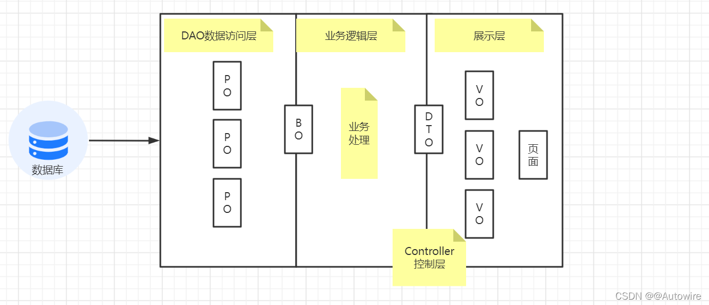

# solon
微内核系统架构

## 服务列表说明
### remote-service
远程调用其他外部服务统一封装入口，不允许直接调用第三方服务，必须由
remote-service封装一层服务代理。
括其它部门 RPC 开放接口，基础平台，其它公司的 HTTP 接口，第三方接口鉴权，调用日志等

# 代码规范
## DDD规范

* PO：Persistent Object，持久化对象。与数据库表结构一一对应，通过DAO层向上传输数据源对象。
* BO：Business Object，业务对象。 由Service层输出的封装业务逻辑的对象。
* DTO：Data Transfer Object，数据传输对象，Service或Manager向外传输的对象。
* VO：View Object，显示层对象，通常是Web向模板渲染引擎层传输的对象。如果没有特殊情况，可以与DTO合并一层
* Query：数据查询对象，各层接收上层的查询请求。 注意超过2个参数的查询封装，禁止使用Map类来传输。

#### PO
该概念随着ORM产生，可以看成是与数据库中的表相映射的Java对象。通常就是对应数据库中某个表中的一条记录。PO仅仅用于表示数据，没有任何数据操作。通常遵守Java Bean的规范，拥有 getter/setter方法。
PO的生命周期：是向数据库中添加新数据时创建，删除数据库中数据时削除的。并且它只能存活在一个数据库连接中，断开连接即被销毁。
PO的作用：可以把数据表中一条记录作为一个对象处理，可以方便的转为其它对象。PO是有状态的，每个属性代表其当前的状态。使用它，可以使我们的程序与物理数据解耦，并且可以简化对象数据与物理数据之间的转换。
PO的特点：

PO的属性是跟数据库表的字段一一对应的
PO对象需要实现序列化接口
一个POJO持久化后就是PO

#### BO
BO用于表示一个业务对象，它包括了业务逻辑，常常封装了对DAO和RPC等的调用，可以进行PO与VO/DTO之间的转换。BO通常位于业务层，BO提供了基本业务单元的基本业务操作，在设计上属于被服务层业务流程调用的对象，一个业务流程可能需要调用多个BO来完成。其实，BO就是PO的组合：
```
简单的例子：PO是一条交易记录，BO是一个人全部的交易记录集合对象；
复杂点儿的例子：PO1是交易记录，PO2是登录记录，PO3是商品浏览记录，PO4是添加购物车记录，PO5是搜索记录，BO是个人网站行为对象。
```
BO是一个业务对象，一类业务就会对应一个BO，数量上没有限制，而且BO会有很多业务操作，也就是说除了get，set方法以外，BO会有很多针对自身数据进行计算的方法。

为什么BO也画成横跨两层呢？原因是现在很多持久层框架自身就提供了数据组合的功能，因此BO有可能是在业务层由业务来拼装PO而成，也有可能是在数据库访问层由框架直接生成。很多情况下为了追求查询的效率，框架跳过PO直接生成BO的情况非常普遍，PO只是用来增删改使用。

#### DTO
DTO用于表示一个数据传输对象，通常用于不同服务或服务不同分层之间的数据传输。这个传输通常指的前后端之间的传输。
DTO是一个比较特殊的对象，他有两种存在形式：
```
在后端，他的存在形式是java对象，也就是在controller里面定义的那个东东，通常在后端不需要关心怎么从json转成java对象的，这个都是由一些成熟的框架帮你完成啦，比如spring框架。
在前端，他的存在形式通常是js里面的对象（也可以简单理解成json），也就是通过ajax请求的那个数据体。
这也是为什么把他画成横跨两层的原因。
```
这里可能会遇到个问题，现在微服务盛行，服务和服务之间调用的传输对象能叫DTO吗？
DTO本身的一个隐含的意义是要能够完整的表达一个业务模块的输出，如果服务和服务之间相对独立，那就可以叫DTO。
如果服务和服务之间不独立，每个都不是一个完整的业务模块，拆开可能仅仅是因为计算复杂度或者性能的问题，那这就不能够叫做DTO，只能是BO。


#### VO
VO就是展示用的数据，不管展示方式是网页，还是客户端，还是APP，只要是这个东西是让人看到的，这就叫VO。
VO主要的存在形式就是js里面的对象（也可以简单理解成json）。

